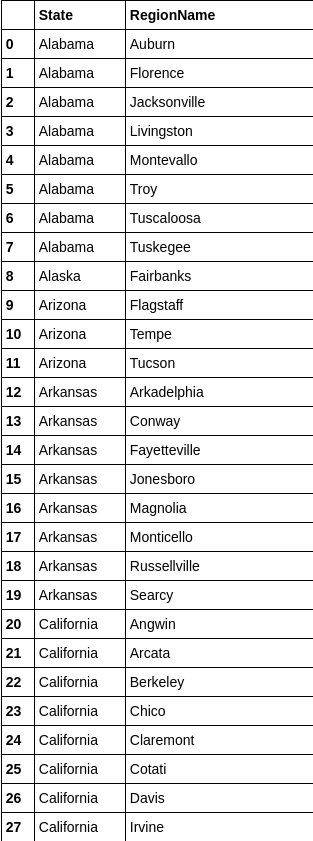

# Applied Data Science with Python Specialization
This is a repository with solutions to the assignments from the data science specialization program by Michigan University at coursera.org

## Course 1 - Introduction to Data Science in Python
This course introduces you to python, but if you are not familiar with the language i encourage you to do a introdutory course of python before, this is just a simple review of the main features of python, the focus will be the introduction of pandas and numpy librarys. They show to you all the main features and important tools they have.

In each of the 4 weeks you will have assignments that you have a dead line to submit, the first one is just a simple quiz about python features, but all the other three are going to teach/test you how to deal with real data sciene problems. 

I'm going to talk just about the 4th one because this one brings all you have done in the others two and add a Student's t-test at the end.

* 4th Assignment

-You will receive 3 files about: median home sale prices at USA, unversity towns at USA and a huge historical of US GDP.
-Your first task is to clean the university towns list and return a dataframe with 517 rows, the first 27 should look like this:

-Your second task is read the file that has the GDP data, the task is to find in which quarter, from 2000 and 